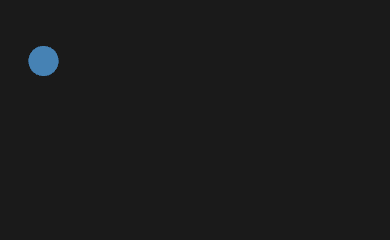

# Mina

[](https://docs.rs/mina/)
[](https://crates.io/crates/mina)
[](https://github.com/focustense/mina/blob/main/LICENSE)
[](https://crates.io/crates/mina)
[](https://github.com/focustense/mina/actions)

A simple, expressive, framework-independent animation library for Rust.

## Features

- Animate the properties of any standard `struct`.
- Concise, [CSS-like syntax][1] for frames and timing.
- State-based animators, à la [CSS transitions][2].
- [Easings][3] included, no math required.
- GUI agnostic - you write the event loop and decide what the properties mean.

## Goals

- **Simple**: Creating and experimenting with animations should be _easy_.
- **Smooth**: Animations should blend well, behave intuitively and never look janky.
- **Adaptable**: Be able to animate simple properties out of the box, and less-simple properties with a few small tweaks.
- **Versatile**: Incorporate into any app with a timer or event loop.

## Timeline Example

_Note: This is example, and all other examples on this page, include only the code used to create the timelines and/or
animators. The full examples will always be available in the [examples directory](examples/)._



```rust
#[derive(Animate)]
struct Shape {
    size: f32,
    #[animate] x: f32,
    #[animate] y: f32,
}

impl Shape {
    pub fn new(size: f32) -> Self {
        Shape { size, x: 0.0, y: 0.0 }
    }
}

let timeline = timeline!(Shape 5s infinite Easing::OutCubic
    from { x: -150.0, y: 60.0 }
    25% { x: 150.0, y: 60.0 }
    50% { x: 150.0, y: -60.0 }
    75% { x: -150.0, y: -60.0 }
    to { x: -150.0, y: 60.0 });
```

See the [full example](examples/basic_timeline.rs) (uses [nannou](https://nannou.cc/)).

## Animator Example


```rust
#[derive(Animate, Clone, Debug, Default)]
struct Effects {
    background_alpha: f32,
    emission_alpha: f32,
    emission_scale: f32,
}

const EFFECT_SCALE: f32 = 2.0;

let animator = animator!(Effects {
    default(Interaction::None, {
        background_alpha: 0.5,
        emission_alpha: 0.25,
        emission_scale: 0.85
    }),
    Interaction::None => [
        0.5s Easing::OutCubic to { background_alpha: 0.5 },
        2s Easing::OutQuint infinite
            from { emission_alpha: 0.0, emission_scale: 0.0 }
            2% { emission_alpha: 0.15, emission_scale: 0.0 }
            5% { emission_scale: 0.85 } Easing::InOutCirc
            75% { emission_alpha: 0.0 }
            100% { emission_scale: EFFECT_SCALE },
    ],
    Interaction::Over => 0.5s Easing::OutCubic to {
        background_alpha: 0.8,
        emission_alpha: 0.0,
        emission_scale: 0.85,
    },
    Interaction::Down => [
        0.5s Easing::OutCubic to {
            background_alpha: 1.0,
            emission_alpha: 0.0,
            emission_scale: 0.85,
        },
        3s Easing::OutExpo
            1% { emission_scale: 1.05 }
            to { emission_alpha: 0.1, emission_scale: 1.5 }
    ]
});
```

The above is taken from the [widget example](examples/iced_widget/main.rs) using [iced](https://github.com/iced-rs/iced).

## Roadmap

- [x] Standalone timelines with builder-style syntax
- [x] State-based animators
- [x] CSS-like grammar using proc macros
- [ ] Tie up loose ends in macro grammar (per-keyframe easing, idents for duration/delay, etc.)
- [ ] GUI-specific sub-crates for plug-and-play integration
- [ ] Expand examples/integration crates to include more GUI libraries
- [ ] Decouple from `enum-map` dependency
- [ ] Built-in [palette](https://docs.rs/palette/latest/palette/) support (for color interpolation)

## More Examples

### [Progress Indicator](examples/delays.rs)


### [Bevy Shapes and Sprites](examples/bevy_app)


### Canvas Example (code coming soon!)


[1]: https://developer.mozilla.org/en-US/docs/Web/CSS/CSS_animations/Using_CSS_animations
[2]: https://developer.mozilla.org/en-US/docs/Web/CSS/CSS_transitions/Using_CSS_transitions
[3]: https://easings.net/
[4]: https://docs.rs/palette/latest/palette/